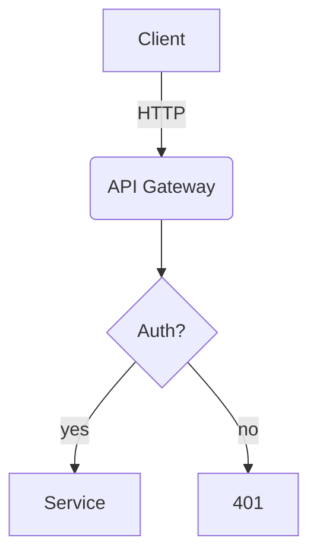
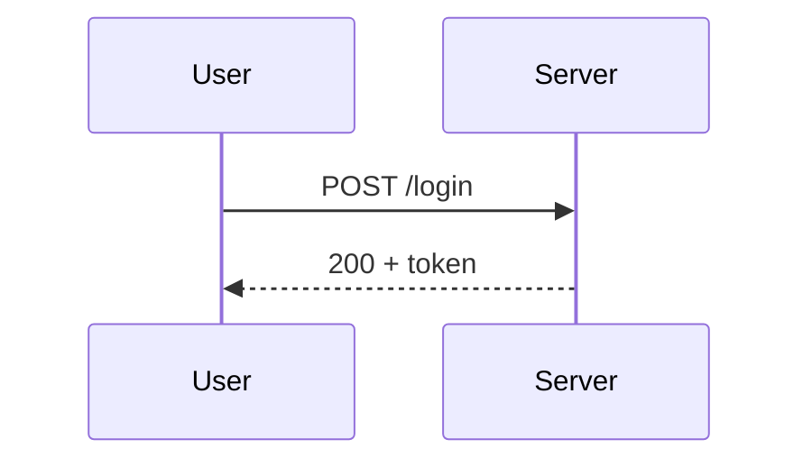
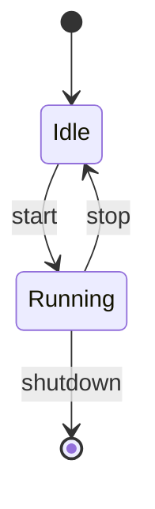

# Mermaid Diagrams

Author diagrams as code in Mermaid. Mermaid renders natively in GitHub, GitLab,
and most Markdown viewers, so it is the default choice for diagrams that live
alongside source and need zero external tooling to view.

## When to use Mermaid vs D2

- **Mermaid (this skill)**: flows and behavior that should render directly in
  Markdown/GitHub - flowcharts, `sequenceDiagram`, `stateDiagram-v2`,
  `erDiagram`, `classDiagram`, `gantt`, and lightweight architecture.
- **D2 (`d2-diagrams` skill)**: polished, presentation-grade software
  architecture / component diagrams with auto-layout and SVG/PNG export.

## Workflow

1. **Understand the subject.** Read the relevant source files, configs, or docs
   before drawing. Diagram what the code actually does, not assumptions.
2. **Pick the diagram type:**
   - Logic / control flow -> `flowchart TD` (or `LR`)
   - Interactions over time / API calls -> `sequenceDiagram`
   - Lifecycle / status transitions -> `stateDiagram-v2`
   - Data model / tables / relations -> `erDiagram`
   - OO structure / types -> `classDiagram`
   - System / service architecture -> `C4Context` / `C4Container`, or a
     subgraph-based `flowchart` for simpler cases
3. **Write the diagram.** Default to embedding a ```` ```mermaid ```` fenced
   block in a Markdown file so it renders on GitHub. Save a standalone `.mmd`
   file only when the user wants an exported image or a reusable source.
4. **Validate / render** with the Mermaid CLI (`mmdc`, available at
   `~/.local/share/nvim/mason/bin/mmdc`):
   ```bash
   mmdc -i diagram.mmd -o diagram.svg        # render to SVG
   mmdc -i diagram.mmd -o diagram.png -s 2   # PNG at 2x scale
   ```
   Rendering also acts as a syntax check - if `mmdc` errors, fix the syntax
   before presenting the diagram.

## Conventions

- Prefer embedding in Markdown over standalone files unless an image export is
  requested.
- Keep node ids short and stable; put human text in labels.
- Use `subgraph` blocks to group related components in architecture flowcharts.
- For large graphs, switch direction (`LR`) and split into multiple focused
  diagrams rather than one unreadable mega-diagram.

## Quick reference






